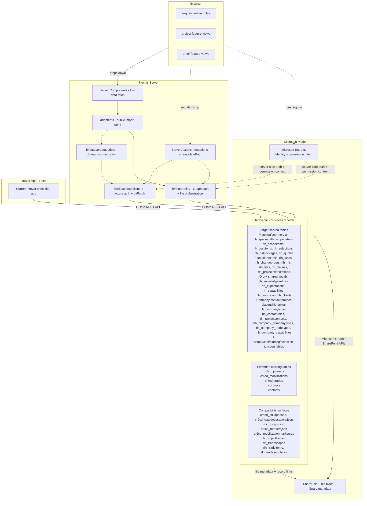
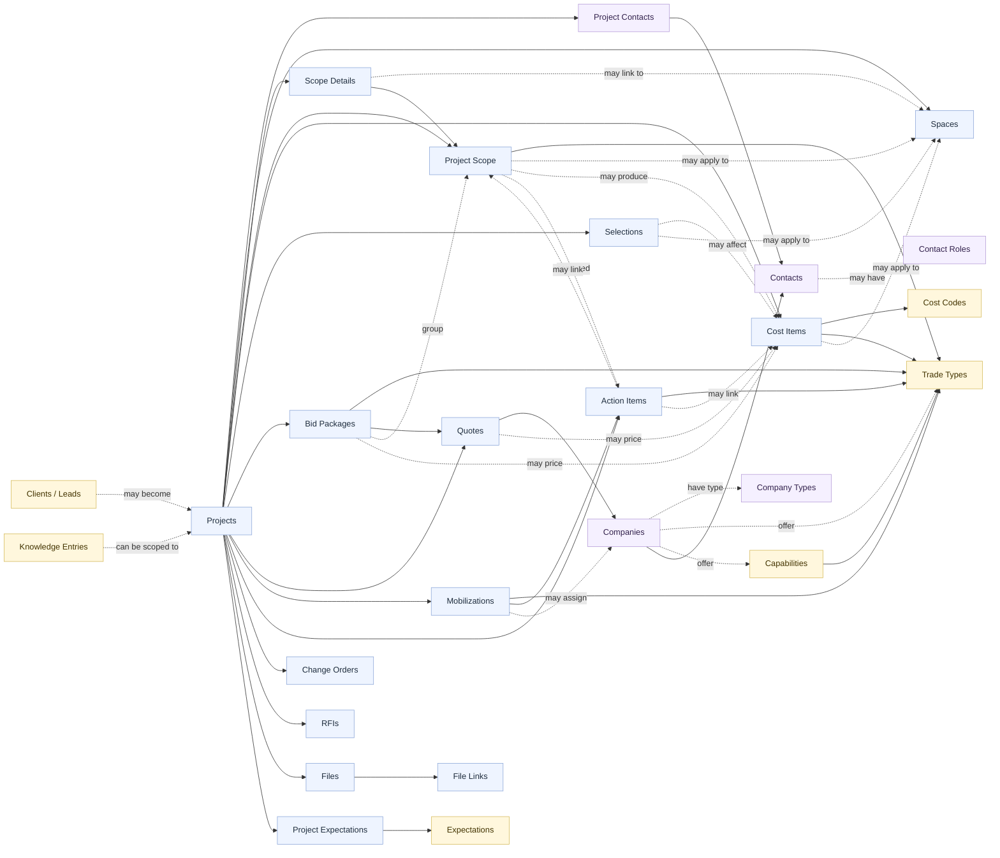
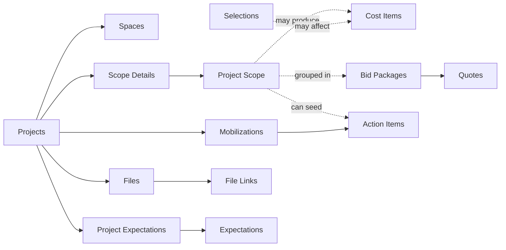

# System Diagram — Architecture + Domain Model

> Status: Authoritative

This diagram covers the target shared architecture and the target shared domain model.

It intentionally distinguishes:

- target shared tables
- extended Trevor tables that stay in the long-term design
- Trevor compatibility surfaces that may remain during transition

---

## Full System Diagram

---

## Domain Model — Object Relationships

This is an object-relationship view of the target shared domain.

It intentionally shows the major record tables and how they relate. It does **not** try to reproduce UI groupings, workflow stages, or every schema-level junction table.

---

## Domain Model — Simplified Overview

---

## Notes For Visio Conversion

If you are building this in Visio:

1. Top section: Browser, Next.js server, Dataverse, SharePoint, Trevor app as peer.
2. Show both the Dataverse query/client path and the SharePoint/Graph file path on the server side.
3. Show Microsoft Entra ID as the identity and permission-intent source, with the shared app enforcing that access on the server side.
4. In Dataverse, split the storage area into three zones: target shared tables, extended existing tables, and compatibility surfaces.
5. In the domain model, show actual record tables and their key relationships. Do not group them into faux workflow containers like "Project Setup" or "Bidding."
6. Keep `Projects` visually central, with shared records and company/people records around the project-scoped records.
7. If you need to show compatibility surfaces, keep them visually separate from the core domain-object view.
